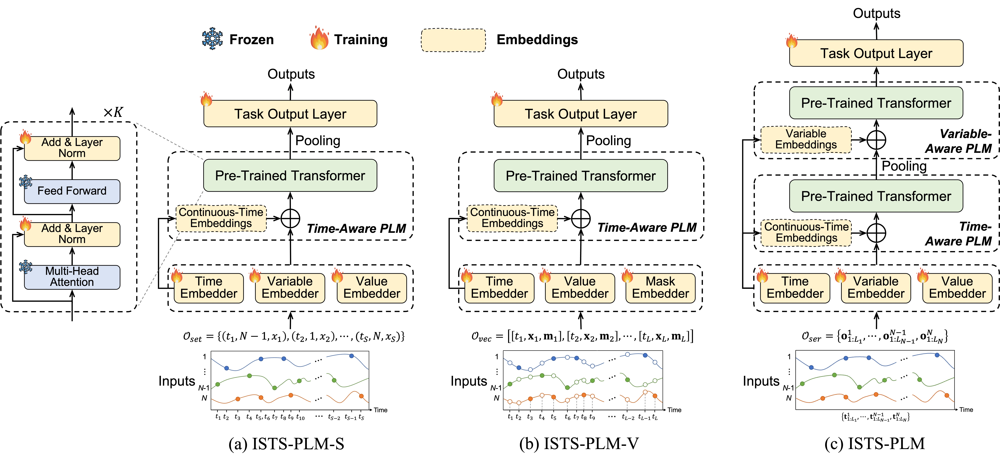
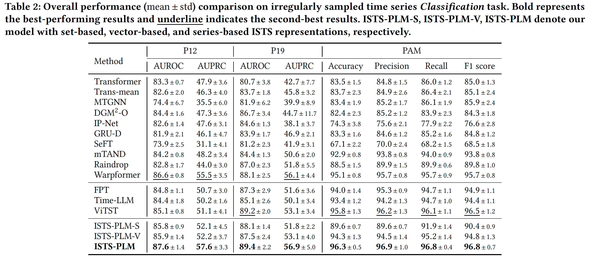
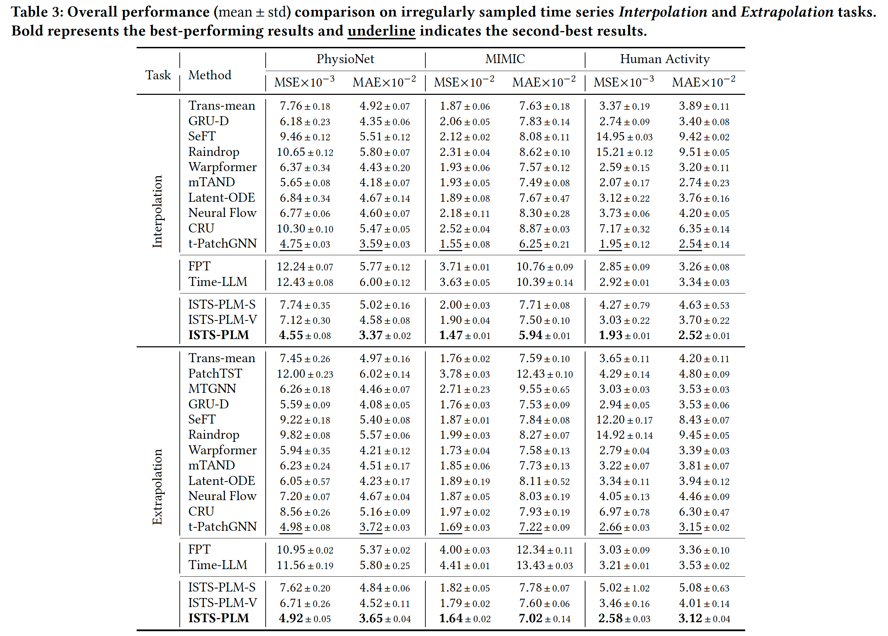

This is an official implementation of **KDD 25** paper [*Unleashing The Power of Pre-Trained Language Models for Irregularly Sampled Time Series*](https://arxiv.org/pdf/2408.08328).


## ISTS-PLM
Framework overview of ISTS-PLM for set-based (ISTS-PLM-S), vector-based (ISTS-PLM-V), and series-based (ISTS-PLM) representation methods of Irregularly Sampled Time Series (ISTS). Given the representation outcome of an ISTS, we first embed it through a trainable input embedding layer to align the embedded ISTS to the semantic space of Pre-trained Language Models (PLMs). Then the embedded series is fed to a time-aware PLM that replaces its positional embeddings with continuous-time embeddings to discern the irregular dynamics within ISTS. For series-based representation, we further introduce a variable-aware PLM to model variables’ correlations within the asynchronous ISTS. All the parameters of PLMs are frozen except layer normalization. Finally, we employ a trainable task output layer to project the output of PLM to address diverse ISTS tasks, such as classification, interpolation, and extrapolation.

<p align="center">
  
</p>


## Main results
Performance comparison on the mainstream ISTS analytical tasks, including **Classification**, **Interpolation** and **Extrapolation**:  

<p align="center">
  
</p>

<p align="center">
  
</p>


## Experimental setup

   ### Requirements

   Your local system should have the following executables:

   - [conda](https://docs.conda.io/projects/conda/en/latest/user-guide/install/index.html)
   - Python 3.9 or later
   - CUDA Version: 12.2
   - git

   ### Create conda environment

   All instructions below should be executed from a terminal.

   1. Clone this repository and run 

   ```bash
cd ISTS-PLM
   ```

   2. Create an environment ```ISTS-PLM``` and activate it.

   ```bash
conda create -n ISTS-PLM python=3.9
conda activate ISTS-PLM
   ```

   3. Install the required Python modules using file [requirements.txt](requirements.txt).

   ```bash
pip install -r requirement.txt
   ```

   4. Download PLMs used in the experiments, including ```gpt2``` (https://huggingface.co/openai-community/gpt2) and ```bert``` (https://huggingface.co/google-bert/bert-base-uncased), and put the downloaded models into folder [PLMs](./PLMs). Note that not limited to the used models, our framework can also accommodate the other more powerful PLMs.


**Notices**: After creating the conda environment, you are supposed to find the ```gpt2``` and ```bert``` of ```transformer``` and copy the files in [model_wope](model_wope) to ```gpt2``` and ```bert```, respectively. The path of the ```gpt2``` and ```bert``` may look like this:

```bash
.conda/envs/ISTS-PLM/lib/python3.9/site-packages/transformers/models/gpt2
.conda/envs/ISTS-PLM/lib/python3.9/site-packages/transformers/models/bert
```

## Preparation of dataset

### Datasets for classification

Download the processed datasets:

(1) **P12** (PhysioNet Mortality Prediction Challenge 2012) https://doi.org/10.6084/m9.figshare.19514341.v1

(2) **P19** (PhysioNet Sepsis Early Prediction Challenge 2019) https://doi.org/10.6084/m9.figshare.19514338.v1

(3) **PAM** (PAMAP2 Physical Activity Monitoring) https://doi.org/10.6084/m9.figshare.19514347.v1


### Datasets for extrapolation and interpolation

For **Physionet**, **Human Activity**, and **USHCN**, we have provided the processed datasets for download.

For **MIMIC**, because of the [PhysioNet Credentialed Health Data License](https://physionet.org/content/mimiciii/view-dua/1.4/), you need to apply the processed dataset at [MIMIC-III-Ext-tPatchGNN](https://physionet.org/content/mimic-iii-ext-tpatchgnn/1.0.0/) for experiments replication.

## Run the model

The scripts for all the experiments are in the [scripts](./scripts). 


### Classification tasks

For example, if you want to reproduce the classification experiment on P12 dataset, please run the following command.

   ```bash
bash scripts/scripts_classification/P12.sh
   ```


   Example:

   ```bash
python classification.py --task {task_name} \
               --lr {learning_rate} \
               --batch {batch_size} \
               --model {model_name} \
               --te_model {plm_type for ts} \
               --st_model {plm_type for var} \
               --n_te_plmlayer {n_layer for ts} \
               --n_st_plmlayer {n_layer for var} \
               --collate {collate_name} \
               --semi_freeze
   ```

   - ```task```: the classification task name, select from ```[P12, P19, PAM]```.
   - ```model```: models with different representation methods ```[istsplm, istsplm_vector, istsplm_set]```.
   - ```collate``` the collate function to represent the irregular time series, select from ```[indseq, vector]```.
   - ```te_model```&```st_model```: the type of PLM used for intra-series modeling and inter-series modeling ```[gpt, bert, ...]```.
   - ```n_te_plmlayer```&```n_st_plmlayer```: the number of PLM layers uses for intra-series modeling and inter-series modeling.
   - ```semi_freeze```: whether or not to fine-tune the ```LayerNorm``` of the PLM.


### Extrapolation and interpolation tasks

For example, if you want to reproduce the extrapolation experiment on physionet dataset, please run the following command.

   ```bash
bash scripts/scripts_extrapolation/physionet.sh
   ```


   Example:

   ```bash
python regression.py --dataset {dataset_name} \
            --task {task_name} \
               --lr {learning_rate} \
               --batch {batch_size} \
               --model {model_name} \
               --te_model {plm_type for ts} \
               --st_model {plm_type for var} \
               --n_te_plmlayer {n_layer for ts} \
               --n_st_plmlayer {n_layer for var} \
               --collate {collate_name} \
               --semi_freeze
   ```

   - ```dataset```: the regression dataset name, select from ```[physionet, mimic, activity, ushcn]```.
   - ```task```: the regression task name, select from ```[forecasting, imputation]```.
   - ```model```: models with different representation methods ```[istsplm_forecast, istsplm_vector_forecast, istsplm_set_forecast]```.
   - ```collate``` the collate function to represent the irregular time series, select from ```[indseq, vector]```.
   - ```te_model```&```st_model```: the type of PLM used for intra-series modeling and inter-series modeling ```[gpt, bert, ...]```.
   - ```n_te_plmlayer```&```n_st_plmlayer```: the number of PLM layers uses for intra-series modeling and inter-series modeling.
   - ```semi_freeze```: whether or not to fine-tune the ```LayerNorm``` of the PLM.


   For more details, please refer to [classification.py](./classification.py) and [regression.py](./regression.py).

## License

The original [MIMIC database](https://mimic.mit.edu/docs/iii/) is hosted and maintained on [PhysioNet](https://physionet.org/about/) under [PhysioNet Credentialed Health Data License 1.5.0](https://physionet.org/content/mimiciii/view-license/1.4/), and is publicly accessible at [here](https://physionet.org/content/mimiciii/1.4/).

Our code in this repository is licensed under the [MIT license](./LICENSE).
